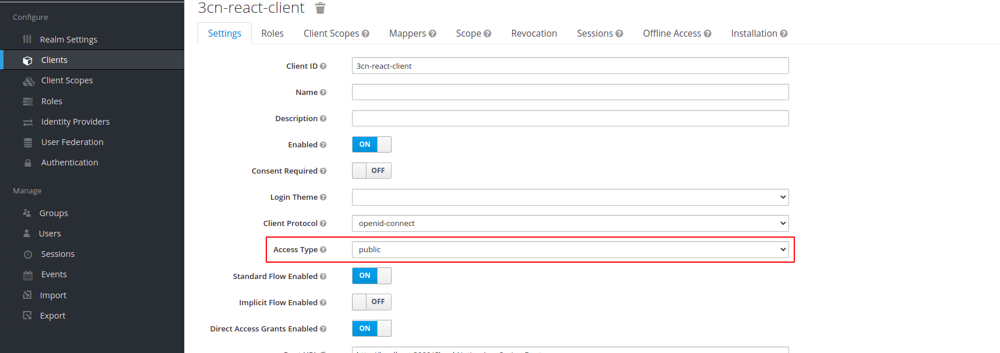

Detail:
======
1. For User End Clients (Like web browser), We have registered a public client in KC auth server like blow. When a user login into the web browser and access this 3cn app, then first it redirects to KC server login page to authorize itself.
It authorizes the user on its user roles.

   
1. When user want to access protected resource, then this user create request using this public client and this client request to required protected resource and this request get through from `api-gateway` and `api-gateway` re-route this request to request protected resource. 
2. `api-gateway` first validate this request acting as `oauth-2 client` from the same `issuer` where the `jwt token` was issued.

Validation
==========
1. #### User Role Validation
In 3cn App, we are validating User Roles at `Clients`
2. #### Scope Validation
In 3cn App, we are validating Scopes in `resource-server` level.
3. #### Audience Validation
In 3cn App, we are validating Audience in `resource-server` level.