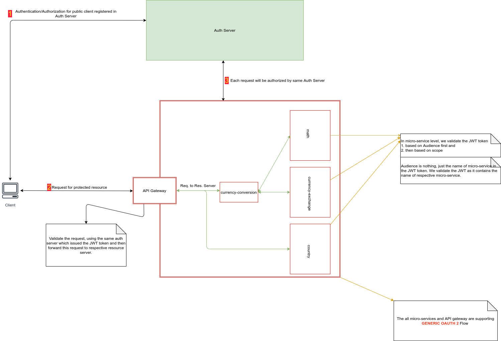

Detail:
======
1. For User End Clients (Like web browser), We have registered a public client in KC auth server like blow. When a user login into the web browser and access this 3cn app, then first it redirects to KC server login page to authorize itself.
It authorizes the user on its user roles.

   
2. When user access protected resource, then this client request to `rest-api` to get processed protected resource. 
3. `rest-api` first validate this request using the `Keycloak Adpater`. `rest-api` then check the user-role for the protected resource.
4. After validating the request and validate the user-role, `rest-api` get the required resource from the protected resource-server hidden behind the `api-gateway-server`.
5. `rest-api` request first goes to `api-gateway-server` which validate the request and re-route this request to respective `resource server`

Validation
==========
1. #### User Role Validation
In 3cn App, we are validating User Roles at `Clients` and `Rest-API` level
2. #### Scope Validation
In 3cn App, we are validating Scopes in `resource-server` level only.
3. #### Audience Validation
In 3cn App, we are validating Audience in `resource-server` level only.